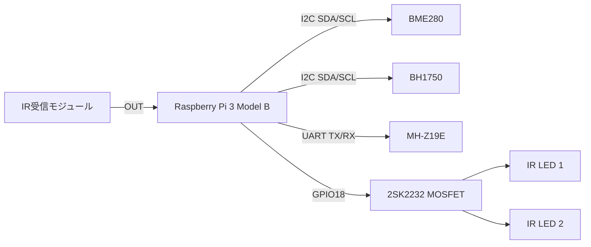
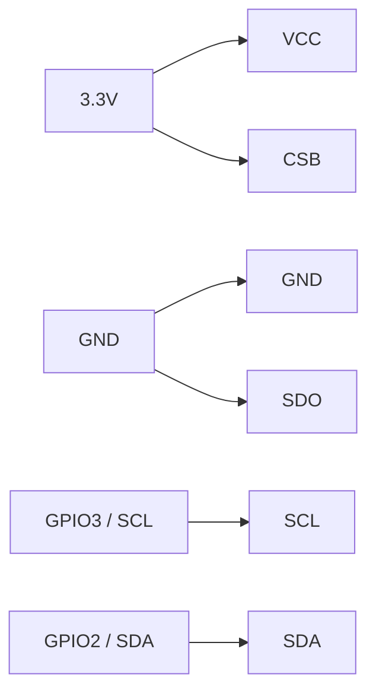
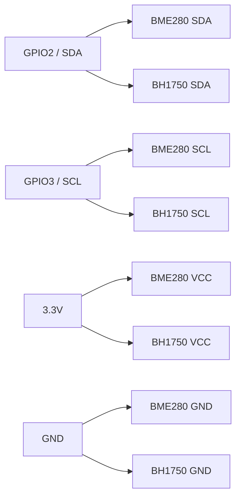
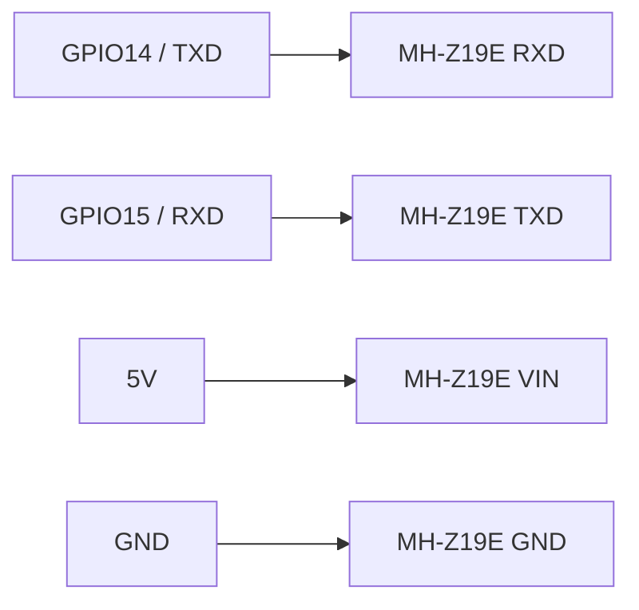
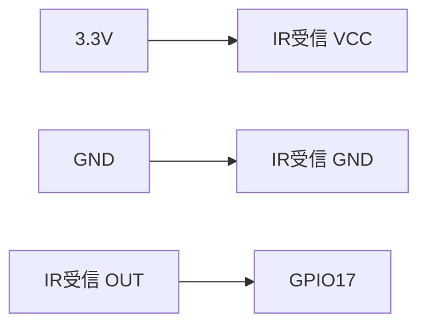
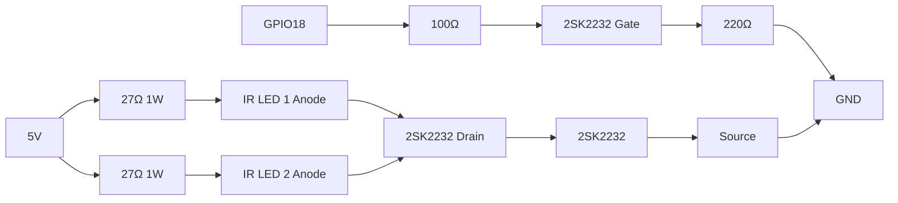

# Raspberry Pi スマートリモコン 配線ドキュメント

この文書は、Raspberry Pi 3 Model B を使ったスマートリモコン・センサーハブの**再構築用配線資料**です。[cite:300] 構成対象は BME280、BH1750、MH-Z19E、IR受信モジュール、IR送信回路（2SK2232 + IR LED 2個）です。[cite:300][web:311]

## 全体構成

センサーは I2C と UART に分け、IR は受信を GPIO17、送信を GPIO18 に割り当てる構成です。[cite:300] BME280 と BH1750 は同じ I2C バスを共有し、MH-Z19E は UART を使います。[cite:300][page:1]



## Raspberry Pi 側ピン割り当て

| 物理ピン | GPIO | 用途 | 備考 |
|---|---|---|---|
| 1 | 3.3V | BME280 / BH1750 / IR受信 電源 | 3.3V系 [cite:300] |
| 2 or 4 | 5V | MH-Z19E / IR LED 電源 | 5V系 [web:311] |
| 3 | GPIO2 | I2C SDA | BME280 / BH1750 共用 [cite:300] |
| 5 | GPIO3 | I2C SCL | BME280 / BH1750 共用 [cite:300] |
| 8 | GPIO14 | UART TXD | MH-Z19E RXDへ [cite:300] |
| 10 | GPIO15 | UART RXD | MH-Z19E TXDから [cite:300] |
| 11 | GPIO17 | IR受信入力 | overlay設定済み [cite:300] |
| 12 | GPIO18 | IR送信制御 | MOSFET Gateへ [cite:300] |
| 6/9/14/20/25 | GND | 共通GND | 全系統共通 [cite:300] |

### 40ピンヘッダの使用イメージ

```text
(上がUSB側の向き)

 3.3V  [1] [2]  5V
 SDA    [3] [4]  5V
 SCL    [5] [6]  GND
 GPIO4  [7] [8]  GPIO14 TX -> MH-Z19E RX
 GND    [9] [10] GPIO15 RX <- MH-Z19E TX
 GPIO17 [11][12] GPIO18 -> MOSFET Gate
 GPIO27 [13][14] GND
 GPIO22 [15][16] GPIO23
 3.3V   [17][18] GPIO24
 GPIO10 [19][20] GND
 GPIO9  [21][22] GPIO25
 GPIO11 [23][24] GPIO8
 GND    [25][26] GPIO7
```

## BME280（6ピン）の配線

6ピンの BME280 基板は I2C/SPI 兼用のことが多く、I2C で使う場合でも CSB と SDO の扱いを決めるのが安全です。[web:315][web:312] BME280 の I2C アドレスは 0x76 または 0x77 で、SDO の接続先で決まります。[web:304][web:312]

| BME280 ピン | 接続先 | 役割 |
|---|---|---|
| VIN / VCC | 3.3V | 電源 |
| GND | GND | GND |
| SCL / SCK | GPIO3（物理5番） | I2Cクロック |
| SDA / SDI | GPIO2（物理3番） | I2Cデータ |
| CSB / CS | 3.3V | I2C固定用 [web:315] |
| SDO / ADDR | GND | アドレスを 0x76 に固定 [web:304] |

### BME280 単体図



### BME280 の要点

最低限で動くのは VCC、GND、SCL、SDA の4本ですが、6ピン版では CSB を 3.3V、SDO を GND にしておくと I2C 動作と 0x76 アドレスが明確になります。[web:315][web:312] 現在の仕様書でも BME280 は I2C bus1 の 0x76 で運用中です。[cite:300]

## BH1750 の配線

BH1750 は I2C の照度センサーで、ADDR を GND にすると 0x23、VCC にすると 0x5C になります。[page:1] BME280 と同じ SDA/SCL に並列でつないで問題ありません。[page:1][cite:300]

| BH1750 ピン | 接続先 |
|---|---|
| VCC | 3.3V |
| GND | GND |
| SDA | GPIO2（物理3番） |
| SCL | GPIO3（物理5番） |
| ADDR | GND（0x23） |
| NC | 未接続 |

### I2C 共有図



## MH-Z19E の配線

MH-Z19E は UART 接続で使い、5V、GND、TXD、RXD の4本を接続します。[web:311][web:314] UART は TX と RX を交差接続します。[web:311]

| MH-Z19E ピン | 接続先 |
|---|---|
| VIN | 5V |
| GND | GND |
| TXD | GPIO15 / RXD（物理10番） |
| RXD | GPIO14 / TXD（物理8番） |

### UART 配線図



### UART の注意

仕様書では `enable_uart=1` が設定済みである一方、`/boot/firmware/cmdline.txt` に `console=serial0,115200` が残っているため、MH-Z19E 追加前にこのシリアルコンソール設定を外す必要があります。[cite:300]

## IR受信モジュールの配線

IR受信モジュールは 3.3V、GND、OUT の3本構成で、OUT を GPIO17 に接続します。[cite:300]



| IR受信モジュール | 接続先 |
|---|---|
| VCC | 3.3V |
| GND | GND |
| OUT | GPIO17（物理11番） |

## IR送信回路（2SK2232 + IR LED 2個）

仕様書では、GPIO18 から 2SK2232 を駆動し、IR LED を2個使う低側スイッチ構成を採る方針です。[cite:300] LEDごとに個別の抵抗を入れるのが前提です。[cite:300]

### 使用抵抗

| 抵抗 | 用途 | 本数 |
|---|---|---|
| 27Ω 1W | IR LED 1 の直列抵抗 | 1 |
| 27Ω 1W | IR LED 2 の直列抵抗 | 1 |
| 100Ω 1/4W | GPIO18 → Gate の直列抵抗 | 1 |
| 220Ω 1/4W | Gate → GND のプルダウン | 1 |

### IR送信回路図



### ASCII 図

```text
5V ──[27Ω]── LED1(+) LED1(-) ─┐
                               ├── Drain (2SK2232)
5V ──[27Ω]── LED2(+) LED2(-) ─┘

GPIO18 ──[100Ω]── Gate (2SK2232)
                     │
                  [220Ω]
                     │
                    GND

Source (2SK2232) ─── GND
```

### Gate 周りの意味

100Ω は GPIO18 から Gate へ入る瞬間的な電流を抑える直列抵抗です。220Ω は Raspberry Pi 起動時や停止時に Gate が浮いて誤点灯しないよう GND に引き下げるプルダウン抵抗です。

### LED 側の注意

IR LED を2本使う場合でも、**1本の抵抗を共有してはいけません**。各 LED に 27Ω を1本ずつ入れて、2本とも Drain に集めます。[cite:300]

## ブレッドボード上の考え方

ブレッドボードでは、5V レール、3.3V レール、GND レールを先に作り、各モジュールをそこへ落とし込むと整理しやすくなります。I2C 系は 3.3V レール、UART の MH-Z19E と IR LED 電源は 5V レール、GND は全系統共通にします。[cite:300][web:311]

```text
[3.3V rail]  -> BME280 VCC, BH1750 VCC, IR受信 VCC, BME280 CSB
[GND rail]   -> BME280 GND, BH1750 GND, IR受信 GND, MH-Z19E GND, MOSFET Source, Gateプルダウン
[5V rail]    -> MH-Z19E VIN, IR LED 2本の直列抵抗の入力側
[SDA line]   -> GPIO2, BME280 SDA, BH1750 SDA
[SCL line]   -> GPIO3, BME280 SCL, BH1750 SCL
[UART TX/RX] -> GPIO14/15 と MH-Z19E RXD/TXD を交差
```

## 組み立て順序

- 1. Raspberry Pi の電源を切る。[cite:300]
- 2. BME280 を 6本構成で接続する。[web:315][web:312]
- 3. BH1750 を同じ I2C バスに追加する。[page:1]
- 4. `i2cdetect -y 1` で 0x76 と 0x23 を確認する。[web:304][page:1]
- 5. IR受信モジュールを GPIO17 へ接続する。[cite:300]
- 6. MOSFET を使った IR送信回路を組む。[cite:300]
- 7. 最後に MH-Z19E を UART へ接続する。[web:311]
- 8. UART コンソール設定を見直してから再起動する。[cite:300]

## 確認ポイント

| 確認項目 | 期待結果 |
|---|---|
| `i2cdetect -y 1` | `0x76` に BME280、`0x23` に BH1750 [web:304][page:1] |
| UART | `serial0` がコンソール専用でない [cite:300] |
| IR送信 | GPIO18 駆動で LED が送信可能 [cite:300] |
| GND | すべての系統で共通GNDになっている | 

## GitHub への反映方針

この文書は `docs/wiring.md` または `docs/wiring-diagram.md` として GitHub に置く想定です。[cite:300] `docs/system-spec.md` には概要とリンクだけを残し、配線の詳細はこの文書へ分離すると管理しやすくなります。[cite:300]
